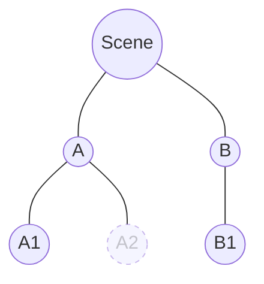

[`setActive(obj, ...)`](/docs/api/operations) switches entire branches of the scene tree on and off without removing them. Useful for pause overlays, hidden rooms, pooled enemies, level changes — any time you want a clean "freeze a slice of the world" toggle.

By default every object is active. `setActive` is **opt-in** — you only call it when you specifically want to disable a piece of the hierarchy.

## activeSelf vs activeInHierarchy

Each `Object3D` carries two notions of "active":

| API | Meaning | Default |
|---|---|---|
| [`getIsActiveSelf(obj)`](/docs/api/operations) | The object's own flag — whatever was last passed to `setActive(obj, ...)`. | `true` |
| [`getIsActive(obj)`](/docs/api/operations) | The effective state: own flag is `true` **and** every ancestor's own flag is also `true`. | `true` |

Components run their lifecycle ([`onAwake`](/docs/api/object3d-behaviour) → [`onEnable`](/docs/api/object3d-behaviour) → [`onStart`](/docs/api/object3d-behaviour), render loop event methods) only while their object's `getIsActive(obj)` is `true`. The component's own [`enabled`](/docs/api/object3d-behaviour) is a second gate **inside** that — if the object is inactive in hierarchy, even an enabled component sits idle.

## Cascade

`setActive(obj, ...)` flips the object's own flag and walks down the subtree, stopping at any descendant whose own flag is already `false` (its subtree was already inactive and stays so).

Take this tree as the starting state — only `A2` was previously set inactive:



| Object | own flag | effective | components |
|---|---|---|---|
| `Scene`, `A`, `B`, `A1`, `B1` | `true` | `true` | running |
| `A2` | `false` | `false` | not running |

Call **`setActive(A, false)`**:

| Object | own flag | effective | what fires |
|---|---|---|---|
| `A` | `false` | `false` | `onDisable` on every active component on `A` |
| `A1` | `true` | `false` | `onDisable` on every active component on `A1` |
| `A2` | `false` | `false` | nothing — was already not running |
| `Scene`, `B`, `B1` | `true` | `true` | untouched |

Call **`setActive(A, true)`** (after the above):

| Object | own flag | effective | what fires |
|---|---|---|---|
| `A`, `A1` | `true` | `true` | `onEnable` on enabled components (or full `onAwake → onEnable → onStart` if it's their first activation) |
| `A2` | `false` | `false` | still not running — `A2`'s own flag is still `false` |

To bring `A2`'s subtree back, call `setActive(A2, true)` separately.

## Priority over `enabled`

A component's [`enable()`](/docs/api/object3d-behaviour) only fires `onEnable` if the object is currently `getIsActive(obj) === true`. Calling `comp.enable()` while an ancestor is inactive flips the component's flag silently — `onEnable` fires later, the moment the next `setActive(ancestor, true)` cascade reaches the component.

```ts title="enabled flips silently on an inactive subtree"
const room = new THREE.Group();
const lamp = new THREE.Object3D();
room.add(lamp);
starter.ctx.scene.add(room);
const lampBhv = addComponent(lamp, LampBehaviour);
starter.start();
// → lampBhv: onAwake → onEnable → onStart fired

setActive(room, false);  // room inactive → lampBhv.onDisable fires
lampBhv.disable();       // already-not-running, no event fires
lampBhv.enable();        // [!code highlight] no onEnable yet — room is still inactive
setActive(room, true);   // [!code highlight] cascade reaches lamp; lampBhv is enabled → onEnable fires now
```

## Code recipes

### Toggle a HUD subtree without unmounting

```ts title="pause / resume any subtree"
import { setActive } from "three-start";

const hud = starter.ctx.scene.getObjectByName("hud")!;

setActive(hud, false); // [!code highlight] every component under `hud` gets onDisable, render loop event methods stop
// ...later
setActive(hud, true);  // [!code highlight] every still-enabled component gets onEnable back
```

### Pre-build an inactive subtree, switch it on later

You can stage objects, attach components, even add to the scene — all while the parent is inactive. Lifecycle is held off until the cascade reaches them.

```ts title="stage now, activate on demand"
import { setActive, addComponent } from "three-start";

const wave = new THREE.Group();
setActive(wave, false); // [!code highlight] turn off BEFORE adding components

for (const i of [0, 1, 2]) {
  const enemy = new THREE.Mesh(geo, mat);
  addComponent(enemy, EnemyAI); // dormant — `wave` is inactive
  wave.add(enemy);
}
starter.ctx.scene.add(wave);
starter.start();
// → none of the EnemyAI instances have run onAwake yet

// gameplay-ready: spawn them all at once
setActive(wave, true); // [!code highlight] cascade fires onAwake → onEnable → onStart on every EnemyAI
```

### Disable a child while its parent is also disabled

`setActive` doesn't care about ordering. The own flag flips immediately; the cascade only fires when the parent chain is also active.

```ts title="setActive on a node deep in an inactive subtree"
import { setActive, getIsActiveSelf, getIsActive } from "three-start";

setActive(room, false);
setActive(lamp, false);   // [!code highlight] no events — `room` is still inactive

getIsActiveSelf(lamp);    // false (we just set it)
getIsActive(lamp);        // false (and `room` is also off)

setActive(room, true);    // cascade walks down → stops at `lamp` because lamp.activeSelf is now false
getIsActive(lamp);        // still false — own flag wins

setActive(lamp, true);    // [!code highlight] now lamp's chain is fully active → onEnable fires on its components
```

### Untouched objects are active by default

`setActive` is opt-in. An object you never pass to it has `activeSelf === true`, no extension allocated:

```ts
const random = new THREE.Object3D();
getIsActiveSelf(random); // true
getIsActive(random);     // true (assuming its ancestors are also untouched)
```

If you later add `random` under an inactive parent, `getIsActive(random)` flips to `false` automatically — its own flag is unchanged, but the chain above it is broken.